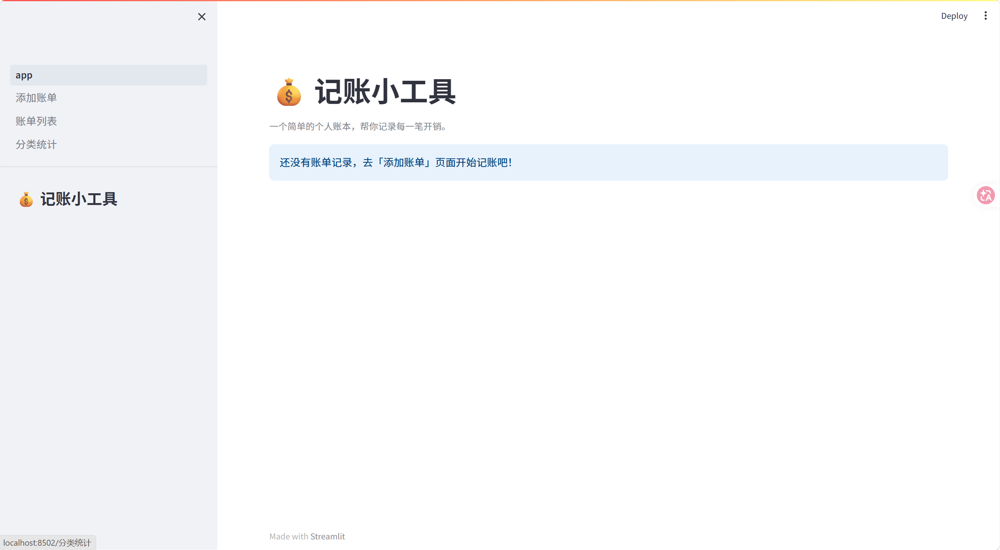
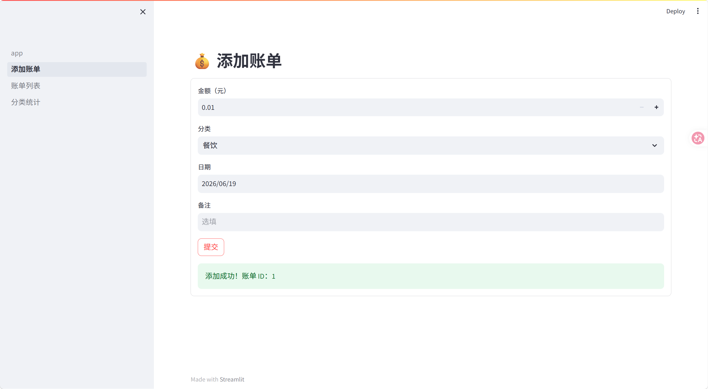
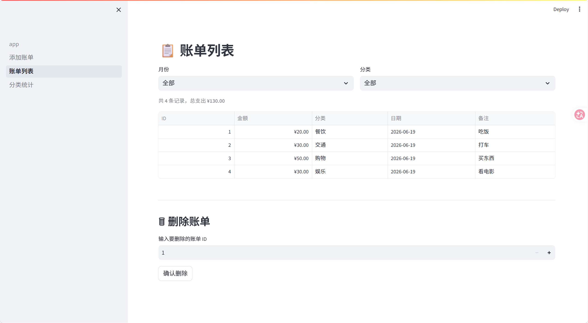
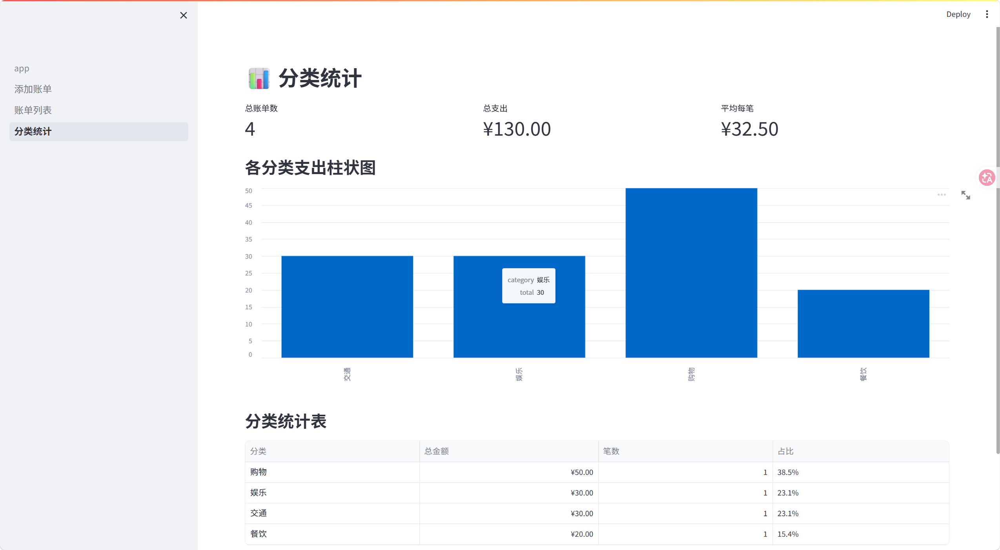

# 💰 简易记账工具

一个基于 **Streamlit + SQLite3** 的个人记账 Web 应用，支持账单的添加、筛选、删除和分类统计，界面简洁、开箱即用。


---

## ✨ 功能亮点

- **📝 添加账单** — 记录金额、分类、日期、备注，表单校验防误输入
- **📋 账单列表** — 按月份 / 分类筛选，表格展示，一键删除
- **📊 分类统计** — 总览卡片、柱状图、统计表，消费分布一目了然
- **🏠 首页总览** — 打开即看总支出、总笔数、最近账单

---

## 📸 界面截图

### 首页


### 添加账单


### 账单列表


### 分类统计


---

## 🚀 快速开始

### 环境要求
- Python 3.8+
- pip

### 安装与运行

```bash
# 1. 克隆仓库
git clone https://github.com/zeng-sdzfxy/Simple-Expense-Tracker.git
cd Simple-Expense-Tracker

# 2. 创建虚拟环境并安装依赖
python -m venv venv
venv\Scripts\pip install -r requirements.txt       # Windows
# source venv/bin/pip install -r requirements.txt   # macOS / Linux

# 3. 启动应用
venv\Scripts\streamlit run app.py                  # Windows
# source venv/bin/streamlit run app.py              # macOS / Linux
```

浏览器会自动打开 `http://localhost:8501`。

---

## 📁 项目结构

```
Simple-Expense-Tracker/
├── app.py                     # 主入口 + 首页总览
├── database.py                # SQLite 数据库层（纯逻辑，无 UI 依赖）
├── pages/
│   ├── 01_添加账单.py          # 添加账单页面
│   ├── 02_账单列表.py          # 账单列表 + 筛选 + 删除
│   └── 03_分类统计.py          # 统计卡片 + 柱状图 + 统计表
├── requirements.txt           # 依赖声明
├── screenshots/               # 界面截图（可选）
└── README.md
```

---

## 🗄️ 数据库设计

| 字段 | 类型 | 说明 |
|------|------|------|
| id | INTEGER | 主键，自增 |
| amount | REAL | 金额（元） |
| category | TEXT | 分类 |
| date | TEXT | 日期（YYYY-MM-DD） |
| notes | TEXT | 备注（可选） |

### 预设分类

```
餐饮 · 交通 · 购物 · 娱乐 · 居住 · 其他
```

---

## 🛠️ 技术栈

| 技术 | 用途 |
|------|------|
| [Streamlit](https://streamlit.io) | Web UI 框架 |
| [SQLite3](https://docs.python.org/3/library/sqlite3.html) | 本地数据存储 |
| [pandas](https://pandas.pydata.org) | 数据处理 & 图表 |

---

## 📄 License

MIT © [zeng-sdzfxy](https://github.com/zeng-sdzfxy)
