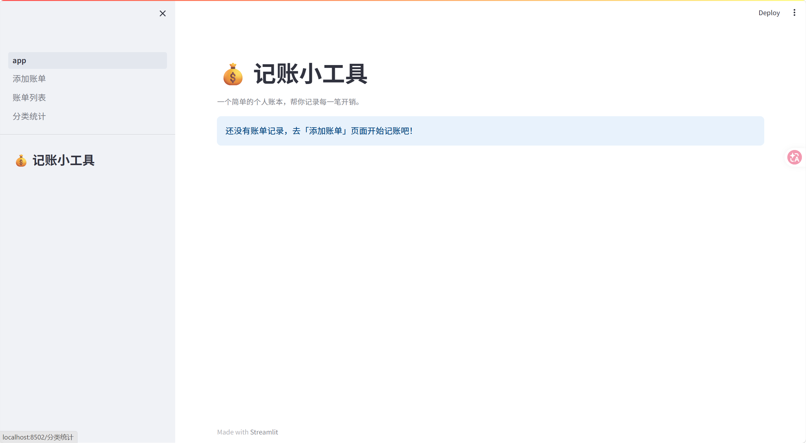
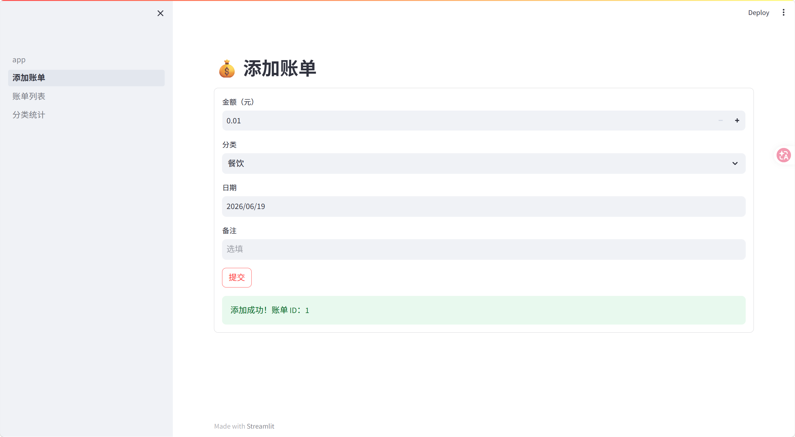
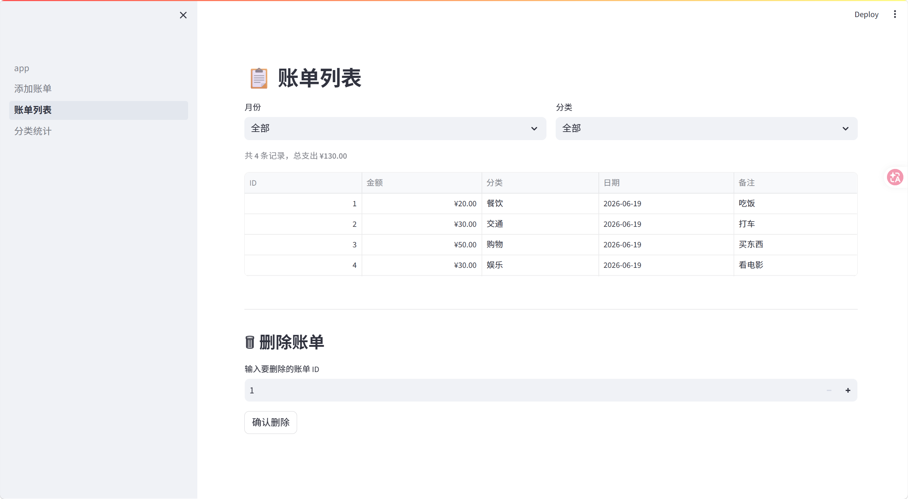
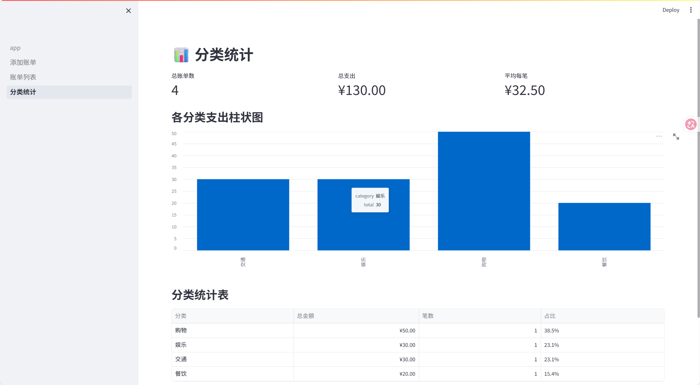

# 💰 简易记账工具 | Simple Expense Tracker

[中文](#中文介绍) | [English](#english)

## 中文介绍

基于 **Python、Streamlit 与 SQLite3** 的轻量级个人记账 Web 应用，支持记录日常支出、浏览账单、筛选删除和分类统计。数据保存在本地 SQLite 数据库中。

### 功能亮点

- **添加账单**：记录金额、分类、日期和可选备注，支持表单校验。
- **账单列表**：按月份、分类筛选，表格展示和删除记录。
- **分类统计**：总览卡片、柱状图和统计表展示消费分布。
- **首页总览**：查看总支出、账单数、分类数和最近 5 条账单。

### 界面截图

| 首页 | 添加账单 |
|---|---|
|  |  |

| 账单列表 | 分类统计 |
|---|---|
|  |  |

### 快速开始

环境要求：Python 3.8+ 和 pip。

```bash
git clone https://github.com/zeng-sdzfxy/Simple-Expense-Tracker.git
cd Simple-Expense-Tracker
python -m venv venv
```

Windows：

```powershell
.\venv\Scripts\python -m pip install -r requirements.txt
.\venv\Scripts\python -m streamlit run app.py
```

macOS / Linux：

```bash
./venv/bin/python -m pip install -r requirements.txt
./venv/bin/python -m streamlit run app.py
```

浏览器通常打开 `http://localhost:8501`。

### 项目结构

| 路径 | 用途 |
|---|---|
| `app.py` | 主入口与首页总览 |
| `database.py` | SQLite 数据库层 |
| `pages/01_添加账单.py` | 添加账单页面 |
| `pages/02_账单列表.py` | 列表、筛选和删除 |
| `pages/03_分类统计.py` | 统计卡片、柱状图和统计表 |
| `requirements.txt` | Python 依赖 |
| `screenshots/` | 界面截图 |

### 数据库设计

| 字段 | 类型 | 说明 |
|---|---|---|
| id | INTEGER | 自增主键 |
| amount | REAL | 金额（人民币元） |
| category | TEXT | 分类 |
| date | TEXT | 日期（YYYY-MM-DD） |
| notes | TEXT | 可选备注 |

预设分类：餐饮、交通、购物、娱乐、居住、其他。

### 技术栈

| 技术 | 用途 |
|---|---|
| Streamlit | Web 界面 |
| SQLite3 | 本地数据存储 |
| pandas | 数据处理和图表 |

---

## English

A lightweight personal expense-tracking web application built with **Python, Streamlit and SQLite3**. Record daily spending, browse transactions, filter or delete records, and explore spending by category. Data is stored in a local SQLite database. The application interface currently uses Chinese labels.

### Features

- **Add expenses:** Record an amount, category, date and optional notes, with form validation.
- **Transaction list:** Filter by month or category, view records in a table and delete entries.
- **Category statistics:** View summary cards, a bar chart and a statistics table.
- **Home dashboard:** See total spending, transaction counts, category counts and the five most recent entries.

### Screenshots

| Home | Add Expense |
|---|---|
|  |  |

| Transaction List | Category Statistics |
|---|---|
|  |  |

### Quick Start

Requirements: Python 3.8+ and pip.

```bash
git clone https://github.com/zeng-sdzfxy/Simple-Expense-Tracker.git
cd Simple-Expense-Tracker
python -m venv venv
```

Windows:

```powershell
.\venv\Scripts\python -m pip install -r requirements.txt
.\venv\Scripts\python -m streamlit run app.py
```

macOS / Linux:

```bash
./venv/bin/python -m pip install -r requirements.txt
./venv/bin/python -m streamlit run app.py
```

Streamlit normally opens the application at `http://localhost:8501`.

### Project Structure

| Path | Purpose |
|---|---|
| `app.py` | Application entry and home dashboard |
| `database.py` | SQLite data layer |
| `pages/01_添加账单.py` | Add-expense page |
| `pages/02_账单列表.py` | Transaction list, filtering and deletion |
| `pages/03_分类统计.py` | Statistics cards, bar chart and table |
| `requirements.txt` | Python dependencies |
| `screenshots/` | Interface screenshots |

### Database Design

| Field | Type | Description |
|---|---|---|
| id | INTEGER | Auto-incrementing primary key |
| amount | REAL | Amount in Chinese yuan (CNY) |
| category | TEXT | Expense category |
| date | TEXT | Date in YYYY-MM-DD format |
| notes | TEXT | Optional notes |

Preset categories: Food & Dining (餐饮), Transportation (交通), Shopping (购物), Entertainment (娱乐), Housing (居住) and Other (其他).

### Technology Stack

| Technology | Purpose |
|---|---|
| Streamlit | Web interface |
| SQLite3 | Local data storage |
| pandas | Data processing and charts |

## License

MIT © [zeng-sdzfxy](https://github.com/zeng-sdzfxy)
